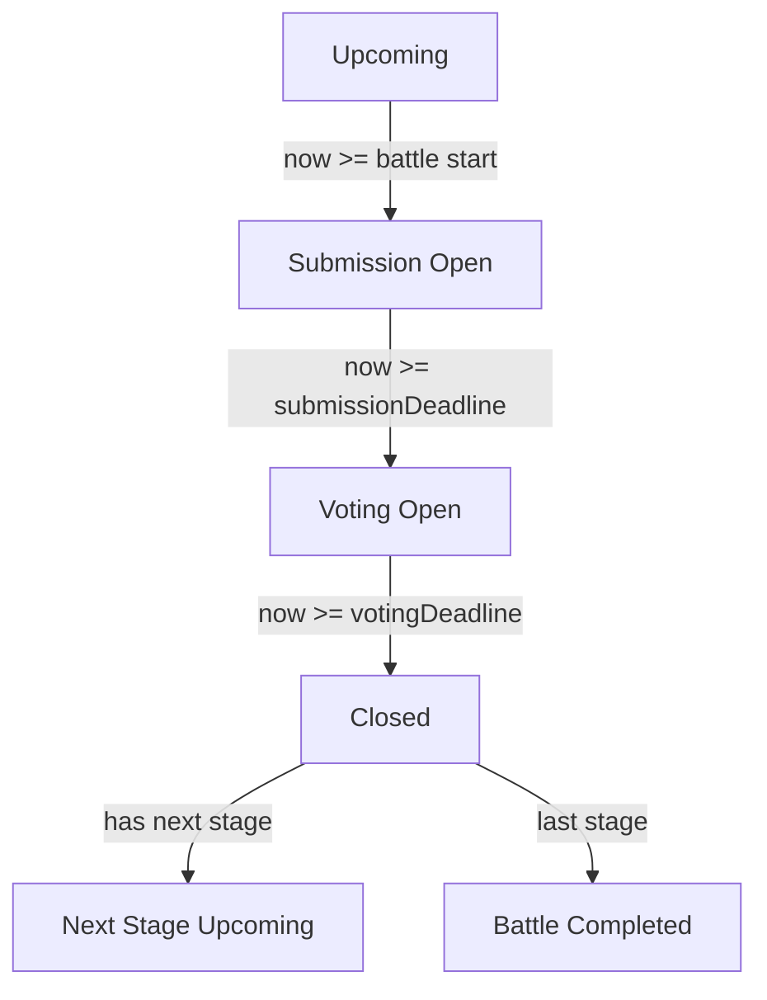

# Stages Design — Sequenced Deadlines and QStash Scheduling

## Overview

Stages are ordered children of a battle. Each stage has a vibe (title), description, submission deadline, voting deadline, and an implied lifecycle: submission → voting → closed/results. Only one stage is active at a time; later stages stay locked until prior voting closes. Deadlines are set as absolute instants in UTC, with a battle-level authoritative IANA timezone to express intent like “Tue 23:59 America/Los_Angeles”.

## Goals

- Enforce sequential play: exactly one active stage; no overlapping submission windows.
- Respect creator-set absolute deadlines while using UTC for storage/validation.
- Gate submissions and votes by active stage + time windows.
- Provide reliable scheduling via Upstash QStash for transitions and reminders.
- Keep reads fast with derived status while maintaining integrity via validation.

## Schema Changes (proposed)

| Entity      | Change                                                                                                                                                                                                                          | Rationale                                            |
| ----------- | ------------------------------------------------------------------------------------------------------------------------------------------------------------------------------------------------------------------------------- | ---------------------------------------------------- |
| battle      | Add `authoritativeTimezone` (IANA), `status` enum, optional `stagesCount`. Keep `doubleSubmissions`, `currentStageId` (stored).                                                                                                 | Needed to express intended wall times and summaries. |
| stage       | Require `stageNumber`, `title`, `submissionDeadline`, `votingDeadline`. Add `phase` enum, `qstashJobIds` (JSON). Use `bigint`/`timestamp` for deadlines. Enforce unique `(battleId, stageNumber)`. Worker owns `phase` updates. | Prevents ambiguity (ms vs s) and ordering conflicts. |
| Constraints | For stage _n_: `submissionDeadline < votingDeadline`. Sequencing: `votingDeadline(n) <= submissionDeadline(n+1)` with zero-gap allowed (UI can warn when gap is very short). Monotonic by `stageNumber`.                        | Guarantees non-overlapping, ordered windows.         |

### Enums

```typescript
// Battle status
type BattleStatus = "draft" | "active" | "completed" | "cancelled";

// Stage phase (worker-owned, updated at transitions)
type StagePhase = "upcoming" | "submission" | "voting" | "closed";
```

### Minimum Duration

All deadlines must be at least **5 minutes** apart:

- `submissionDeadline - now >= 5min` (on create)
- `votingDeadline - submissionDeadline >= 5min`
- `submissionDeadline(n+1) - votingDeadline(n) >= 0` (zero-gap allowed)

### QStash Job Storage

Each stage stores `qstashJobIds` as JSON array of `{ action: string, messageId: string }` for cancel/reschedule on edits.

## Lifecycle & Gating

### Active Stage Definition

- **Stage 1**: active from battle start until `votingDeadline(1)` passes
- **Stage N (N > 1)**: active when `now >= votingDeadline(N-1)` AND `now < votingDeadline(N)`
- **Battle completed**: when `now >= votingDeadline(lastStage)`; battle `status` transitions to `completed`

### Phase Transitions (per stage)

| Phase        | Condition                                                                  | Actions Allowed        |
| ------------ | -------------------------------------------------------------------------- | ---------------------- |
| `upcoming`   | `now < stageStart` (stage 1: battle start; stage N: `votingDeadline(N-1)`) | View only              |
| `submission` | stage is active AND `now < submissionDeadline`                             | Submit tracks, view    |
| `voting`     | stage is active AND `submissionDeadline <= now < votingDeadline`           | Vote, view submissions |
| `closed`     | `now >= votingDeadline`                                                    | View results           |

**Note**: Submissions and voting are mutually exclusive. Once `submissionDeadline` passes, no new submissions; voting opens immediately.

### Boundary Conditions (exclusive end)

- Submission deadline: `now < submissionDeadline` (submissions at exact deadline are **rejected**)
- Voting deadline: `now < votingDeadline` (votes at exact deadline are **rejected**)
- This avoids ambiguity and race conditions at boundaries

### State Ownership

- `currentStageId` and `phase` are stored and maintained by worker/cron (QStash)
- Gating uses stored active stage + server time; never relies on client time



## Validation Rules

- Battle create/update with stages array must enforce: unique stage numbers; required fields present; deadlines monotonic and non-overlapping; timezone provided.
- Stage edits revalidate the entire sequence to avoid parallel windows; prefer batch updates for multiple stages.
- Worker keeps stored `phase`/`currentStageId` in sync on transitions; app logic treats them as authoritative.
- Progression is time-driven; no `resultsReady` gate (can be added later if needed).
- Server time is authoritative; convert creator inputs from battle TZ → UTC before storage.

## API / Logic Surface

- **Reads**: expose derived fields per stage: `phase` (`upcoming_submission`, `submission_open`, `voting_open`, `closed`), `isActive`, `timeRemaining`, `nextStageStartsAt` (submission deadline of next stage).
- **Mutations**:
  - Create battle with staged deadlines (creator/admin). Sets `authoritativeTimezone`, validates sequence, stores UTC instants.
  - Update stages (creator/admin) with full revalidation; reschedule jobs as needed.
  - Submit tracks: enforce active stage window and `doubleSubmissions` limit.
  - Vote: enforce active stage voting window.
  - Results/advance: worker/cron/QStash handler triggers results generation after `votingDeadline`, updates stored `phase`, and advances stored `currentStageId`.
- Handlers must gate by active stage, not just by comparing `now` to that stage’s deadlines in isolation.

## Scheduling with Upstash QStash

- **Use cases**: schedule per-stage transitions (submission open notice, voting open if distinct, voting close/results, advance-to-next-stage), update stored `phase`/`currentStageId`, and optional reminders.
- **Payload/metadata**: include `battleId`, `stageId`, `stageNumber`, `action`, `expectedDeadline` (UTC), `authoritativeTimezone`, and an idempotency hash. Persist QStash job IDs per stage for cancel/reschedule on edits.
- **Handlers**: verify QStash signature; fetch fresh battle/stage; guard checks (`now >= expectedDeadline`, prior stages closed, optional `resultsReady`); if already applied or mismatched, return 2xx no-op for idempotency.
- **Scheduling flow**: on battle create/update, compute UTC instants from battle TZ; enqueue jobs. On deadline changes, cancel & recreate affected jobs. If zero-gap allowed, schedule next-stage-open at prior `votingDeadline`; otherwise include configured buffer.
- **Retries/DLQ**: enable exponential backoff and DLQ; alert on DLQ entries. Handlers must be duplicate-safe and order-agnostic.
- **Security**: signature verification, narrow endpoint, rate limiting; server time remains authority.
- **Manual override**: admin endpoint to replay/reschedule jobs or force advance when necessary.

## Edge Cases & Protections

- **DST**: compute instants using `authoritativeTimezone`; store UTC to avoid wall-clock drift.
- **Clock skew**: trust server time; clients display local time but cannot gate actions.
- **Zero-gap**: `votingDeadline(n) == submissionDeadline(n+1)` is allowed; client can surface guidance if the gap feels too short.
- **Late results**: results generation runs at votingDeadline; provide retries/manual replay. If failures are detected, optionally pause advancement before setting next `currentStageId`.

## Cancellation & Deletion

### Battle Cancellation

When a battle is cancelled (`status` → `cancelled`):

1. Cancel all pending QStash jobs for all stages (iterate `qstashJobIds`)
2. Set all stage phases to `closed`
3. Battle remains queryable but no further actions allowed
4. Existing submissions/votes preserved for record

### Battle Deletion

When a battle is deleted:

1. Cancel all pending QStash jobs first (must succeed before deletion)
2. Cascade delete stages, submissions, votes per foreign key constraints
3. Consider soft-delete with `deletedAt` timestamp for audit trail

### Stage Modification Rules

| Battle Status | Stage Edits Allowed                                                             |
| ------------- | ------------------------------------------------------------------------------- |
| `draft`       | Full CRUD on stages                                                             |
| `active`      | Only future deadlines can be extended; no reordering/deletion of started stages |
| `completed`   | No edits                                                                        |
| `cancelled`   | No edits                                                                        |

**On deadline change for active battle**:

1. Validate new deadlines maintain sequence invariants
2. Cancel affected QStash jobs via stored `messageId`
3. Schedule new jobs
4. Update `qstashJobIds`

## Testing Plan

### Validation

- Creation rejects unsorted/overlapping deadlines and duplicate stage numbers
- Creation rejects deadlines less than 5 minutes apart
- Submission/vote handlers reject non-active stages, post-deadline interactions, and over-limit submissions when `doubleSubmissions` is true

### Boundary Conditions

- Submission at exact `submissionDeadline` is rejected (exclusive)
- Vote at exact `votingDeadline` is rejected (exclusive)
- Submission 1ms before deadline succeeds
- Vote 1ms before deadline succeeds

### Phase Progression

- Stage 1 starts in `submission` phase at battle start
- Stage 1 transitions to `voting` at `submissionDeadline`
- Stage 1 transitions to `closed` at `votingDeadline`; stage 2 becomes active
- Battle status → `completed` when last stage closes

### Cancellation

- Battle cancellation cancels all pending QStash jobs
- Cancelled battle rejects new submissions/votes
- Stage edits rejected on cancelled/completed battles

### Idempotency

- Worker updates to stored `phase`/`currentStageId` remain idempotent across retries
- Duplicate QStash deliveries return 2xx without side effects

### Timezone

- Timezone conversion correctness across DST boundaries for scheduling and validation

## Unresolved Questions

1. **Soft delete vs hard delete**: Should battles/stages use soft delete (`deletedAt`) for audit trail? Depends on compliance needs.
2. **Notification system**: Do we need webhooks/push notifications on phase transitions? Out of scope for MVP but worth considering.
3. **Submission vs Voting phase distinction**: Current design collapses them into the same time window. Do we need separate `submissionDeadline` and `votingStartsAt` for a gap between?
