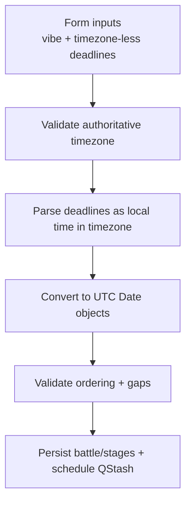

# Battle deadline timezone handling fix (2026-01-01)

## Overview

Battle creation currently parses stage deadlines with the server's local timezone even though the creator supplies an authoritative IANA timezone. This misaligns stored deadlines, stage transitions, and QStash scheduling when the server timezone differs from the creator's.

## Goals

- Interpret submission/voting deadlines using the provided authoritative timezone.
- Preserve existing validation rules while applying timezone-aware conversion to UTC.
- Surface clear errors for invalid or unparseable deadline inputs/timezones.

## Plan

1. Validate the provided authoritative timezone string before processing stages.
2. Add a helper to parse timezone-less deadline strings into UTC instants using the authoritative timezone.
3. Apply the helper within stage parsing/validation and keep downstream scheduling unchanged.
4. Run formatters and sanity-check logic paths touched by the change.

## Luxon Adoption (follow-up)

1. Add `luxon` dependency (npm import) and wire it for timezone handling.
2. Replace custom timezone parsing helpers with Luxon utilities.
3. Update battle/stage deadline parsing to rely on Luxon.
4. Remove redundant custom code and reformat touched files.

## Approach

- Use Luxon `DateTime.fromISO` with the authoritative timezone to interpret timezone-less inputs.
- Convert Luxon instants to JS `Date` objects for storage and scheduling.
- Fail fast with descriptive errors when parsing fails or timezone is invalid.

## Unresolved questions

None.
